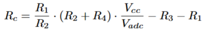
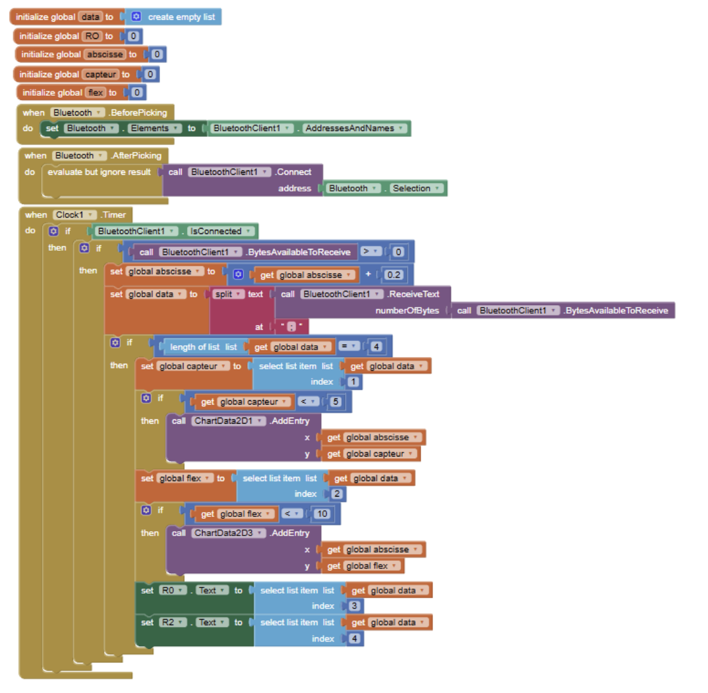
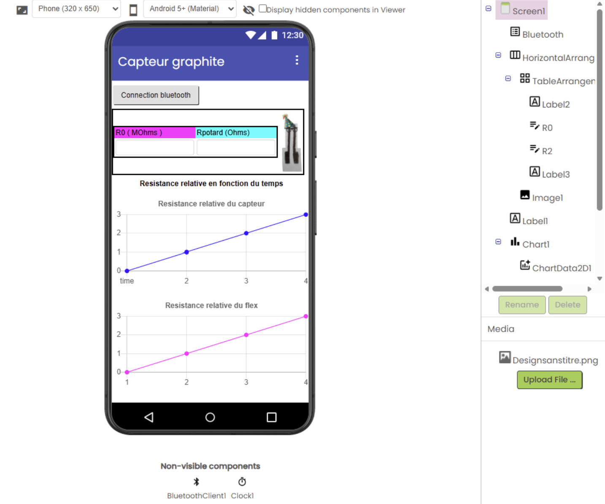
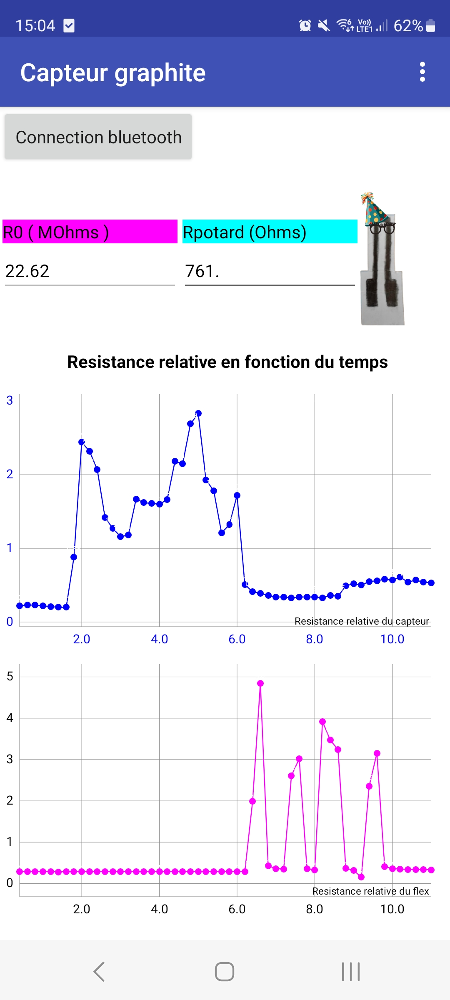
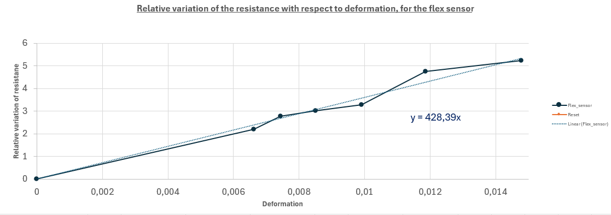

# Partie I : Contexte 

Le but de ce projet est de réaliser un capteur de flexion lowtech à base de crayon à papier et d'une feuille de papier.  
L'origine de ce projet vient d'un article publié en 2014 dans Nature par _Lin, CW, Zhao, Z., Kim, J. et al._ nommé "**Pencil Drawn Strain Gauges and Chemiresistors on Paper "**.  
Le capteur est dessiné par dépot de graphite sur une feuille à l'aide d'un crayon de papier. Ce dépot est un système granulaire dont la conductance dépend de la distance inter-grain. Plus la distance inter-grain diminue, plus la conductance augmente. C'est exactement ce qu'il se passe lorsque la feuille est placé en compression. De ce fait, on peut théoriquement déduire l'angle de flexion de la feuille en fonction de la résistance du capteur.  
  
Notre travail consiste a réaliser le capteur, le circuit électronique de lecture et de le tester afin de le comparer à des capteurs commerciaux. 

## Partie I.1 : Liste des Livrables

1. Un shield PCB adapté pour une Arduino UNO permettant de faire la mesure de résistance du capteur graphite, celle du capteur commercial et de connecter un module Bluetooth pour envoyer les résulats sur une application.
2. Une application Android (sous MIT App Inventor) permettant de voir la valeur de la résistance mesuré et la variation relative de résistance.
3. Le code Arduino qui gère la mesure de flexion et le module bluetooth
4. Le protocole de mesure du banc de test
5. La datasheet du capteur graphite

## Partie I.2 : Liste du matériel utilisé

1. Capteur en graphite 
   - Feuille de papier d'épaisseur 0.35mm
   - Différents crayons à papier (B, 3B et 6B)
2. Arduino et modules
   - Carte Arduino UNO + câble USB
   - Module Bluetooth HC-05
   - Flex Sensor + résistance de 47 kΩ
3. Circuit amplificateur
   - Amplificateur opérationnel LTC1050
   - Condensateurs : 2* 100 nF + 1* 1 µF
   - Résistances :  1* 1kΩ + 1* 10kΩ + 2* 100kΩ
   - Potentiomètre digital MCP 41010
4. Matériel pour réaliser le PCB
   - Plaque d'époxy recouverte d'une couche de cuivre et de résine photosensible
   - Matériel de développement : Machine UV + révélateur + perclorure de fer
   - Machine à perforer
   - Fer à souder + étain
   - Pin headers
5. Banc de test
   - Banc de test creux avec différents rayons de courbures connus.
   

# Partie II : Réalisation théorique

## Partie II.1 : Conception du circuit amplificateur
La résistance du capteur est énorme, de l'ordre du Mega-Ohm, ainsi le courant obtenu en sortie est très faible. Il nous faut donc amplifier le signal afin de l'exploiter.  

Pour ce faire nous avons réaliser un circuit amplificateur transimpédance que nous avons simulé sur LTSpice visible en figure II.1

   
  <em>Figure II.1 – Schéma LTSpice du capteur et du circuit amplificateur</em>

Sur le logiciel de simulation, nous avons modélisé l’alimentation de l’Arduino en 5 V, alimentation qui fournit également l’énergie nécessaire au capteur et à l’amplificateur opérationnel (AOP).
Le capteur a ensuite été représenté à l’aide d’un générateur de pulses, ce qui permet de simuler son comportement dynamique.
Afin de reproduire des conditions réelles, une source de bruit a été ajoutée au montage. 

Le circuit amplificateur est constitué de trois filtres passe-bas, chacun ayant un rôle bien précis dans l’élimination des bruits indésirables.

   - Filtre passe-bas 16 Hz (en entrée)

Ce filtre permet de supprimer les bruits parasites provenant de vibrations mécaniques ou de tremblements.

$$ Fc_{1}  = \frac{1}{2\pi * C1 * R1 } = \frac{1}{2\pi * 100n * 100k}  ≃ 16 Hz$$

   - Filtre passe-bas 1.6 Hz (réduction du bruit 50 Hz)

Ce filtre atténue les résidus issus du bruit secteur 50 Hz.

$$ Fc_{2}  = \frac{1}{2\pi * C2 * R4 } = \frac{1}{2\pi * 1µm * 100k}  ≃ 1.6 Hz $$

   - Filtre passe-bas 1.6 kHz (en sortie de l’AOP)

Ce filtre élimine les bruits haute fréquence générés par l’électronique (AOP, câblage, parasites HF).

$$ Fc_{3}  = \frac{1}{2\pi * C3 * R5 } = \frac{1}{2\pi *100n * 1k}  ≃ 1.6 KHz $$

Plusieurs simulations ont été effectuées afin de vérifier :
- L'amplication du signal fourni par le capteur
- La filtration du bruit 

À partir du montage, il est également possible de déterminer la relation mathématique reliant la résistance du capteur à sa tension de sortie : 

    
  <em> (Eq.1) </em>

## Partie II.2 : Design du PCB sous KiCad

Une fois la forme du circuit fixé et tous les modules connectés à l'Arduino chosis, nous avons pu concevoir la shield.  
Pour ce faire, nous utilisons le logiciel KiCad. 
Comme tous les composants n'étaient pas présent dans la bibliothèque de composant de KiCad, nous avons dû réalisé les schématiques et les empreintes du flex sensor, du capteur graphite, du module bluetooth et du potentiomètre digital.   
Voilà le schématique complet de notre shield :   

   
  <em>Figure II.2 – Schématique kicad du projet</em>

Concernant les empreintes, nous n'allons pas souder les composants onéreux directement. Ainsi pour le flex sensor et le module bluetooth nous avons prévu des pins dans lesquels nous brancherons les modules. Pour l'AOP et le potentiomètre nous allons souder des support DIP8.  
Ainsi notre empreinte ressemble à cela :  

   
  <em>Figure II.3 – Empreinte du projet</em>

Enfin la modélisation 3D donne :  

  
  <em>Figure II.4 – Modélisation 3D du projet</em>

# Partie III : Fabrication du PCB

Une fois le PCB conçu, vérifié et corrigé sous KiCad, nous pouvons passer à sa fabrication. Pour cela, le circuit est exporté depuis KiCad sous la forme d’un fichier typon, qui servira de base pour la gravure du circuit imprimé.

À insérer : image du fichier typon

## Partie III.1 : Développement

Le fichier typon est imprimé sur une feuille transparente afin de créer un masque. Ce masque est ensuite positionné sur une plaque d’époxy recouverte de cuivre et d’une résine photosensible.La plaque est exposée aux rayons UV, ce qui permet de transférer le motif des pistes du typon sur la résine. Après exposition, la plaque est plongée dans un révélateur afin d’éliminer la résine photosensible des zones exposées. Elle est ensuite immergée dans un bain de perchlorure de fer, qui dissout le cuivre non protégé et fait apparaître les pistes du circuit.

Une fois cette étape terminée, les pistes sont vérifiées à l’aide d’un multimètre afin de détecter d’éventuelles coupures ou courts-circuits. Certaines pistes imparfaitement révélées ont été corrigées manuellement à l’aide d’un cutter.

## Partie III.2 : Création du PCB

Après la gravure, les trous nécessaires à l’implantation des composants sont percés à l’aide de deux forets de diamètres différents : 0,8 mm et 1 mm, en fonction des composants. Les composants électroniques sont ensuite soudés sur la carte. Un via a également été réalisé en soudant un fil reliant une piste spécifique à la masse, comme indiqué sur le typon.

  
   
  <em>Figure III.2 – Soudure du PCB avec un via </em>

## Partie III.3 : Tests

Enfin, des tests ont été réalisés pour vérifier le bon fonctionnement du circuit. Nous avons notamment vérifié que l’amplificateur amplifiait correctement la tension de sortie du capteur.

# Partie IV : Code Arduino

Pour créer le code final Arduino chargé de gérer les différents composants ; le potentiomètre digital, le module Bluetooth, le flex sensor et l’AOP. Nous avons d’abord testé ,indépendamment, l’ensemble des éléments du circuit final sur une breadboard 
puis, chaque code a été adapté pour être cohérent avec notre projet.
Enfin nous avons regroupé ces codes pour obtenir un code global qui contrôle tous les modules ensemble.

## Partie IV.1 : Code du potentiomètre digital

Le potentiomètre digital est contrôlé en lui envoyant un indice compris entre 0 et 255, lequel détermine une valeur de résistance.
Après caractérisation expérimentale, nous avons observé que le potentiomètre suit la loi :

$$ R=58+indice×37 \quad (Ω)$$

Une fonction de centrage est exécutée dans la void setup() du programme.
Son objectif est de centrer le signal de sortie autour de 2,5 V en ajustant la résistance du potentiomètre digital.

Une boucle for fait varier l’indice de 0 à 255.
Pour chaque valeur, nous envoyons l’indice au potentiomètre et vérifions si la tension de sortie se situe autour de 2,5 V ± 0,4 V.
Si cette condition est remplie, la boucle est interrompue.
Si elle ne l’est jamais, la boucle se termine naturellement et nous conservons l’indice pour lequel la tension était la plus proche de 2,5 V.

À partir de cet indice, nous déduisons la résistance du potentiomètre $$𝑅_{2}$$ grâce à la loi caractérisée puis, grâce à l’équation 1, nous retrouvons la résistance initiale du capteur avant déformation, notée $$𝑅_{0}$$

## Partie IV.2 : Code pour le flex sensor

Nous utilisons une fonction mesure_flex() qui renvoie la variation relative de résistance du flex sensor.

Nous mesurons d’abord la tension aux bornes du flex, notée $$𝑉_{flex}$$.
La résistance du flex sensor est obtenue via :

$$ R_{flex} = R_{div}* (\frac{Vcc}{V_{flex}} -1)$$

En connaissant la résistance du flex à plat $$𝑅_{flat}$$ et la resistance du pont diviseur $$R_{div} = 47 kΩ$$.

Nous pouvons aussi calculer la variation relative de la resistance du flex sensor : $$\frac{R_{flex} - R_{flat}}{ R_{flat}}$$
	​
## Partie IV.3 : Application MIT Bluetooth

Les informations suivantes sont envoyées à l’application Bluetooth, séparées par des points :

- la variation relative du capteur
- la variation relative du flex sensor
- la résistance du capteur avant déformation ( $$R_{0}$$)
- la résistance du potentiomètre digital ( $$R_{2}$$)

Ces données sont envoyées depuis le programme principal Arduino.

Voici le code de notre application MIT :

  
  <em>Figure IV.1 – Code de l'application MIT</em>

L’application MIT reçoit en boucle les informations envoyées, les place dans une liste, puis exécute les opérations suivantes uniquement lorsque la liste contient 4 éléments :  
	- Les résistances $$R_{0}$$ et $$R_{2}$$ sont affichées dans des zones de texte   
	- les variations relatives sont ajoutées aux deux graphes : un graphique pour le flex sensor et un graphique pour le capteur.

L’interface de l’application est présentée ci-dessous :

  
   
  <em>Figure IV.2 – Face avant de l'application MIT, à gauche dans la phase de design, à droite en utilisation </em>

# Partie V : Banc de test et caractérisation

Le circuit et le code étant fonctionnel, nous nous sommes lancé dans la caractérisation du capteur. Pour cela nous utilisons un banc de test, présenté en figure V.1, dont les dimensions sont connues. Grâce au programme de centrage, on obtient une tension centré autour de 2.5V et on rappelle que la résistance du capteur est donnée par la formule : 

    
  <em> (Eq.1) La resistance 2 étant celle du potentiomètre digital </em>

Le banc de test a des rayons de courbures allant de 1cm à 2,5cm par incrément de 0,25cm. Pour réaliser la mesure on étale le capteur sur le banc de test en le fixant de sorte à ce qu'il épouse la forme. Par cette technique la déformation appliquée est connue et contrôlée, nous permettant de caractériser de manière fiable le capteur.  
Les variables d'intérêts sont la variation relative de résistance et la déformation, elles sont définies comme : 

 
   
  <em>(Eq.2) Ici R0 correspond à la résistance du capteur lorsqu'il est plat (flat resistance) </em>

Avec tout cela nous avons pu obtenir les courbes caractéristiques de notre capteur en fonction de différents crayons à papier utilisé. Pour cela deux méthodes ont été employées :   
- Méthode 1 : la résistance R0 n'est redéterminée qu'au début des mesures       
- Méthode 2 : la résistance R0 est redéterminée entre chaque mesure      
Ces deux méthodes sont nécessaires car le capteur est très sensible à la perte de matière dû aux utilisations, ainsi la resistance R0 peut beaucoup varier d'une mesure à une autre. Cependant, dans une application réelle, il n'est pas forcément possible de revenir à l'état plat entre chaque mesure ainsi la méthode 1 est importante.   
 

  
   
  <em>Figure V.1 : Banc de test utilisé </em>

Les différentes courbes obtenues sont présentés ci-dessous, le coefficient de proportionnalité sur les courbes linéaires correspond à la sensibilité du capteur. La déformation en compression n'a été faite qu'avec le crayon 6B car ce test est plus coûteux en matière pour le capteur. Ainsi, sur les crayons moins gras, l'augmentation de résistance dû à la perte de matière prédominait devant la chute dû à la compression.

**Crayon 6B** 

 
   
  <em>Figure V.2 : Courbe charactéristique du capteur avec le crayon 6B en tension </em>

 
   
  <em>Figure V.3 : Courbe charactéristique du capteur avec le crayon 6B en compression </em>

**Crayon 3B**

 
   
  <em>Figure V.4 : Courbe charactéristique du capteur avec le crayon 3B en tension </em>

**Crayon B** 

 
   
  <em>Figure V.5 : Courbe charactéristique du capteur avec le crayon B en tension </em>

**Capteur commercial**

 
   
  <em>Figure V.6 : Courbe charactéristique du capteur commercial en tension </em>

Il est clair que le capteur que le capteur se détériore au fil des utilisations car la méthode 1 et la méthode 2 ne donnet pas les mêmes résultats.  
On remarque que la sensibilité est plus forte pour les crayons moins gras, cependant la resistance étant beaucoup plus grande le signal et les mesures obtenues sont beaucoup plus irrégulières et le capteur moins durable. En effet, le capteur perd trop de matière trop vite pour être utilisé de manière répétée.  La linéarité du capteur se voit particulièrement sur le crayon 6B qui a une courbe de tendance proche des données mesurées.  
Par ailleurs, sur le crayon 3B avec la méthode 2, on observe clairement un comportement exponentiel, se rapprochant de la théorie des systèmes granulaires.  
En comparaison avec le capteur commercial, présenté en figure V.6, notre capteur a une piètre sensibilité et surtout subit des déformations irréversibles modifiant sa résistance à plat contrairement au capteur commercial.

# Partie VI : Conclusion

 
   
  <em>Figure VI : Tableau comparatif du capteur graphite et du capteur industriel </em>

# Contacts

Voici nos contacts si vous souhaitez des informations complémentaires

Bacchin Lisa : bacchin@insa-toulouse.fr
Barre Ronan : barr@insa-toulouse.fr
