# Partie I : Contexte 

Le but de ce projet est de réaliser un capteur de flexion lowtech à base de crayon à papier et d'une feuille de papier.  
L'origine de ce projet vient d'un article publié en 2014 dans Nature par _Lin, CW, Zhao, Z., Kim, J. et al._ nommé "**Pencil Drawn Strain Gauges and Chemiresistors on Paper "**.  
Le capteur est dessiné par dépot de graphite sur une feuille à l'aide d'un crayon de papier. Ce dépot est un système granulaire dont la conductance dépend de la distance inter-grain. Plus la distance inter-grain diminue, plus la conductance augmente. C'est exactement ce qu'il se passe lorsque la feuille est placé en compression. De ce fait, on peut théoriquement déduire l'angle de flexion de la feuille en fonction de la résistance du capteur.  
  
Notre travail consiste a réaliser le capteur, le circuit électronique de lecture et de le tester afin de le comparer à des capteurs commerciaux. 

## Partie I.1 : Liste des Livrables

1. Un shield PCB adapté pour une Arduino UNO permettant de faire la mesure de résistance du capteur graphite, celle du capteur commercial et de connecter un module Bluetooth pour envoyer les résulats sur une application.
2. Une application Android (sous MIT App Inventor) permettant de voir la valeur de la résistance mesuré et la variation relative de résistance.
3. Le code Arduino qui gère la mesure de flexion et le module bluetooth
4. Le protocole de mesure du banc de test
5. La datasheet du capteur graphite

## Partie I.2 : Liste du matériel utilisé

1. Capteur en graphite 
   - Feuille de papier
   - Différents crayons à papier (HB, 2B, 4B…)
2. Arduino et modules
   - Carte Arduino UNO + câble USB
   - Module Bluetooth HC-05
   - Flex Sensor + résistance de 47 Ω
3. Circuit amplificateur
   - Amplificateur opérationnel LTC1050
   - Condensateurs : 1* 100 nF + 1* 1 µF
   - Résistances :  1*1kΩ + 1*10kΩ + 2*100kΩ
   - Potentiomètre digital MCP 41xxx
4. Matériel pour réaliser le PCB
   - Plaque d'époxy recouverte d'une couche de cuivre et de résine photosensible
   - Matériel de développement : Machine UV + révélateur + perclorure de fer
   - Machine à perforer
   - Fer à souder + etain
   - Pin headers 

# Partie II : Réalisation théorique

## Partie II.1 : Conception du circuit amplificateur
La résistance du capteur est énorme, de l'ordre du GigaOhm, ainsi le courant obtenu en sortie est très faible. Il nous faut donc amplifier le signal afin de l'exploiter.  

Pour ce faire nous avons réaliser un circuit amplificateur transimpédance que nous avons simulé sur LTSpice.

  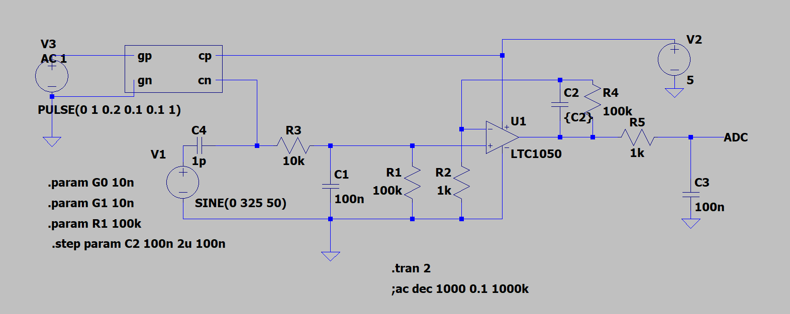 
  <em>Figure 1 – Schéma LTSpice du capteur et du circuit amplificateur</em>

## Partie II.2 : Design du PCB sous KiCad

Une fois que nous avons fixé ce la forme de notre circuit et tous les modules que nous voulons connecté à l'Arduino, nous avons pu concevoir la shield.  
Pour ce faire, on a utilisé le logiciel KiCad. 
Comme tous les composants n'étaient pas présent dans la bibliothèque de composant de KiCad, nous avons dû réalisé les schématiques et les empreintes du flex sensor, du capteur graphite, du module bluetooth et du potentiomètre digital.   
Voilà le schématique complet de notre shield :   

  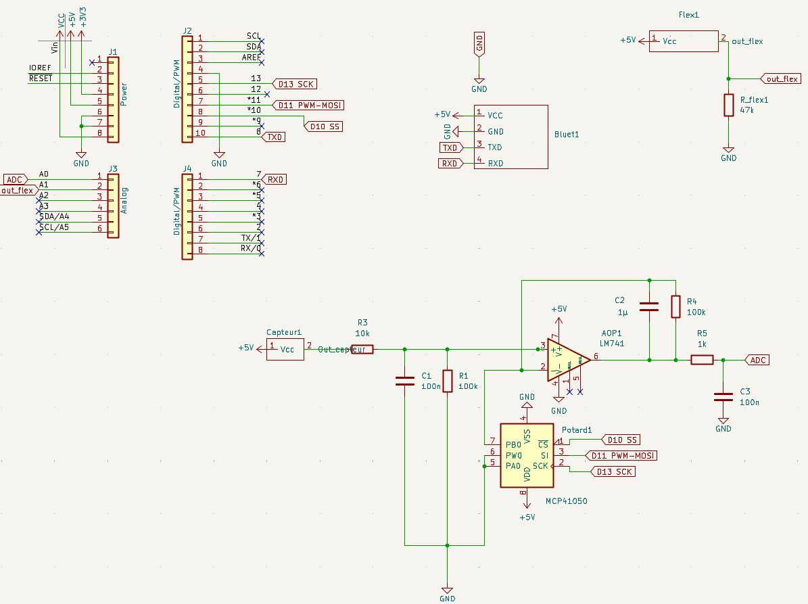 
  <em>Figure 2 – Schématique kicad du projet</em>

Concernant les empreintes, nous n'allons pas souder les composants onéreux directement. Ainsi pour le flex sensor et le module bluetooth nous avons prévu des pins dans lesquels nous brancherons les modules. Pour l'AOP et le potentiomètre nous allons souder des support DIP8.  
Ainsi notre empreinte ressemble à cela :  

  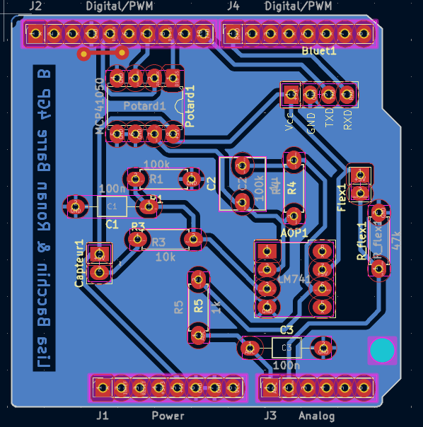 
  <em>Figure 3 – Empreinte du projet</em>

Enfin la modélisation 3D donne :  

 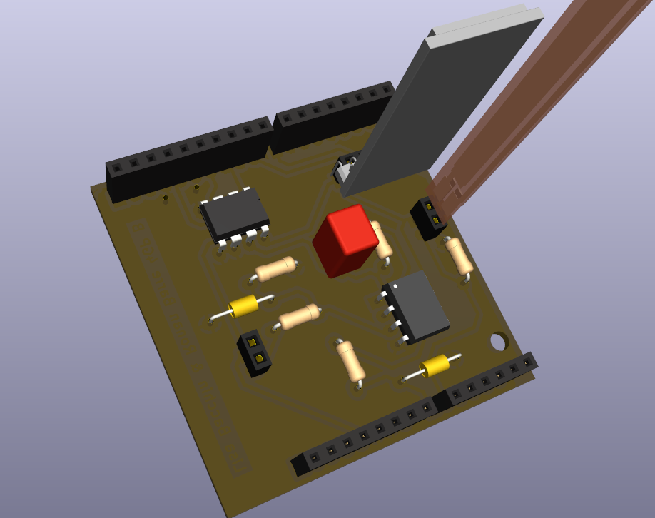 
  <em>Figure 3 – Modélisation 3D du projet</em>

# Partie III : Fabrication et Fonctionnement
## Partie III.1 : Fabrication du PCB
Une fois le PCB conçu, vérifié et corrigé sous KiCad, nous pouvons passer à sa fabrication. Pour cela, le circuit est exporté depuis KiCad sous la forme d’un fichier typon, qui servira de base pour la gravure du circuit imprimé.

À insérer : image du fichier typon

1. Développement

Le fichier typon est imprimé sur une feuille transparente afin de créer un masque. Ce masque est ensuite positionné sur une plaque d’époxy recouverte de cuivre et d’une résine photosensible.La plaque est exposée aux rayons UV, ce qui permet de transférer le motif des pistes du typon sur la résine. Après exposition, la plaque est plongée dans un révélateur afin d’éliminer la résine photosensible des zones exposées. Elle est ensuite immergée dans un bain de perchlorure de fer, qui dissout le cuivre non protégé et fait apparaître les pistes du circuit.

Une fois cette étape terminée, les pistes sont vérifiées à l’aide d’un multimètre afin de détecter d’éventuelles coupures ou courts-circuits. Certaines pistes imparfaitement révélées ont été corrigées manuellement à l’aide d’un cutter.

2. Création du PCB

Après la gravure, les trous nécessaires à l’implantation des composants sont percés à l’aide de deux forets de diamètres différents : 0,8 mm et 0,6 mm, en fonction des composants. Les composants électroniques sont ensuite soudés sur la carte. Un via a également été réalisé en soudant un fil reliant une piste spécifique à la masse, comme indiqué sur le typon.

  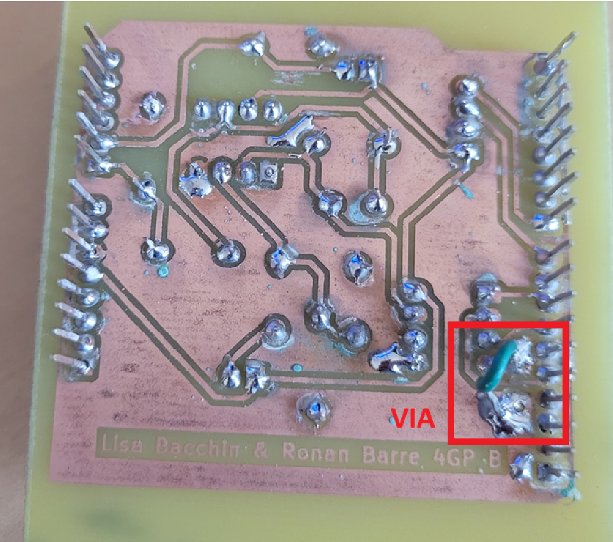
  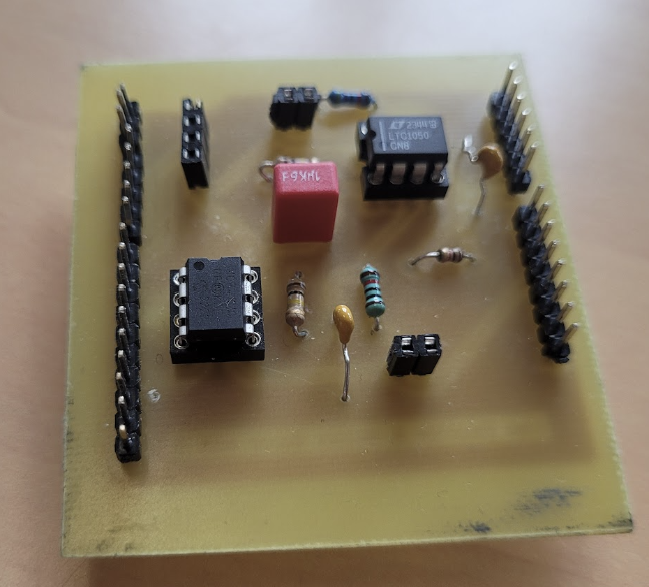 
  <em>Figure 4 – Soudure du PCB</em>

3. Tests

Enfin, des tests ont été réalisés pour vérifier le bon fonctionnement du circuit. Nous avons notamment vérifié que l’amplificateur amplifiait correctement la tension de sortie du capteur, ce qui a été confirmé expérimentalement.

## Partie III.2 : Code et test du potentiometre digital

## Partie III.3 : Application android

# Partie IV : Banc de test et caractérisation

Le circuit et le code étant fonctionnel, nous nous sommes lancé dans la caractérisation du capteur. Pour cela nous utilisons un banc de test, présenté en figure IV.1, dont les dimensions sont connues. Grâce au programme de centrage, on obtient une tension centré autour de 2.5V et on rappelle que la résistance du capteur est donnée par la formule : 

  
  <em> (Eq.1) La resistance 2 étant celle du potentiomètre digital </em>

Le banc de test a des rayons de courbures allant de 1cm à 2,5cm par incrément de 0,25cm. Pour réaliser la mesure on étale le capteur sur le banc de test en le fixant de sorte à ce qu'il épouse la forme. Par cette technique la déformation appliquée est connue et contrôlée, nous permettant de caractériser de manière fiable le capteur.  
La variable d'intérêt est la variation relative de résistance par rapport à la déformation, elles sont définies comme : 

 
  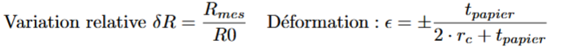
  <em>(Eq.2) Ici R0 correspond à la résistance du capteur lorsqu'il est plat (flat resistance) </em>

  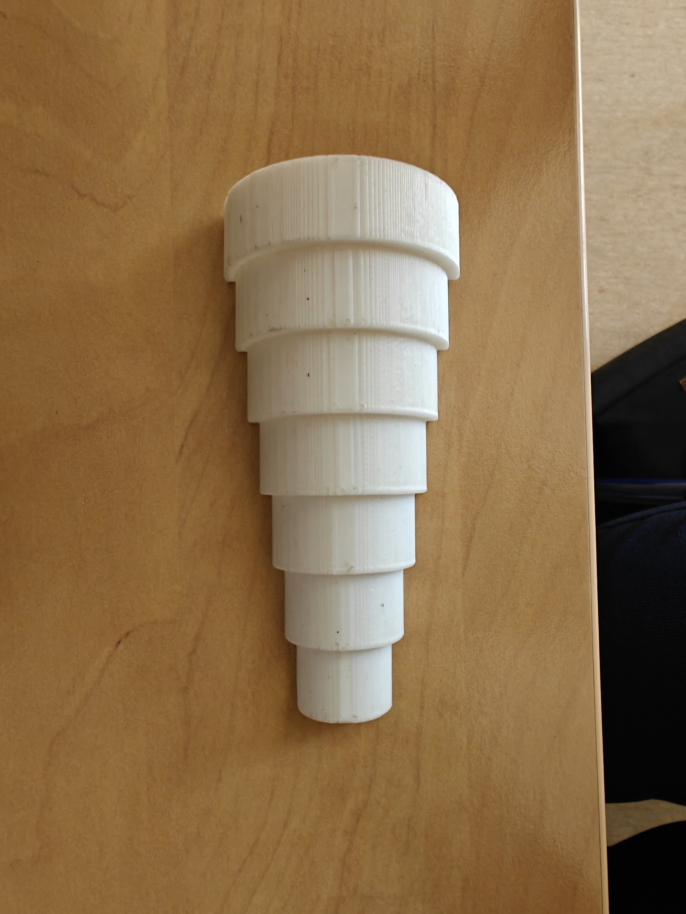
  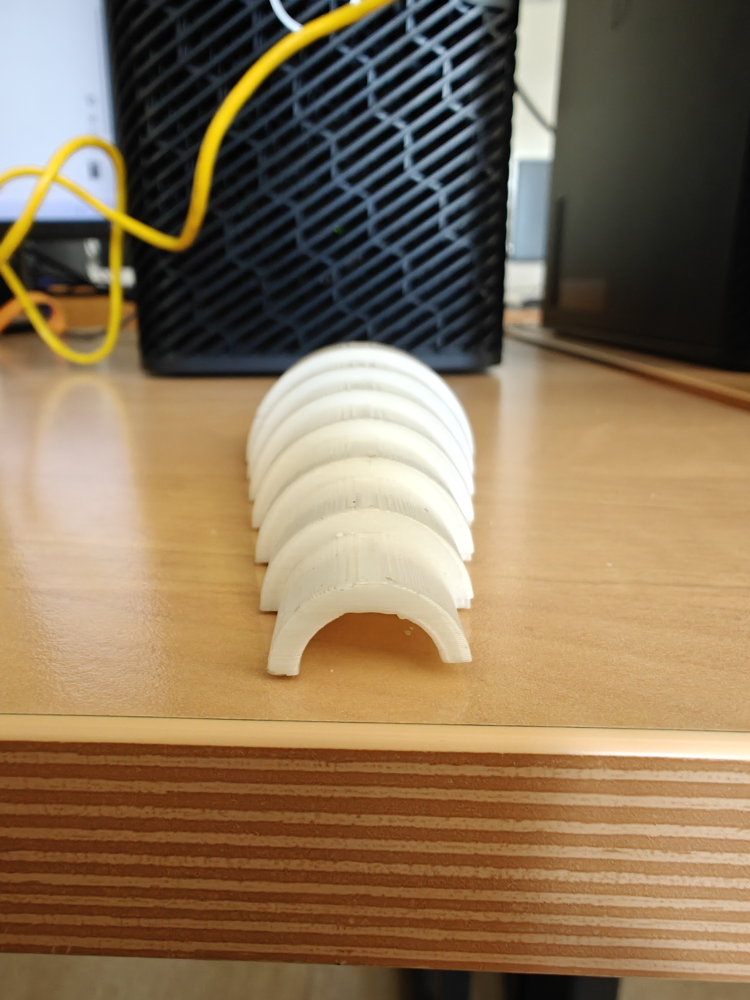
  <em>*Figure IV.1* : Banc de test utilisé </em>

Avec tout cela nous avons pu obtenir les courbes caractéristiques de notre capteur en fonction de différents crayons à papier utilisé. Pour cela deux méthodes ont été employées :   
- Méthode 1 : la résistance R0 n'est réinitialisé qu'au début des mesures       
- Méthode 2 : la résistance R0 est réinitialisé entre chaque mesure      
Ces deux méthodes sont nécessaires car le capteur étant très sensible à la perte de matière du aux utilisations, la resistance R0 change beaucoup. Cependant dans une application réelle il n'est pas forcément possible de revenir à l'état plat entre chaque mesure ainsi la méthode 1 est importante.   
 
Les différentes courbes obtenues sont présentés ci-dessous, le coefficient de proportionnalité sur les courbes linéaires correspond à al sensibilité du capteur. 

**Crayon 6B** 

 
  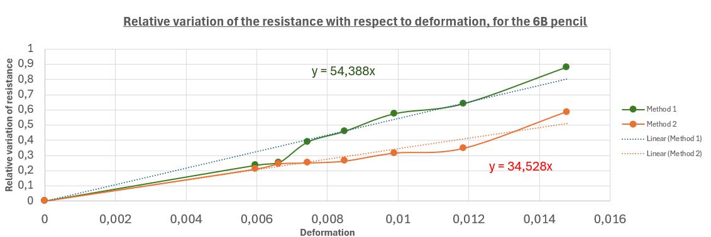 
  <em>Figure IV.2 : Courbe charactéristique du capteur avec le crayon 6B en tension </em>

 
  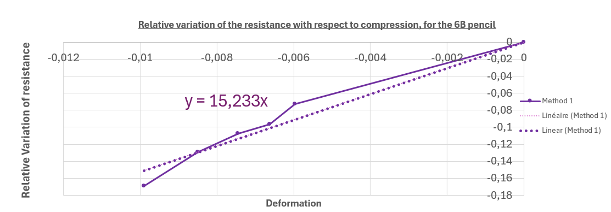 
  <em>Figure IV.3 : Courbe charactéristique du capteur avec le crayon 6B en compression </em>

**Crayon 3B**

 
  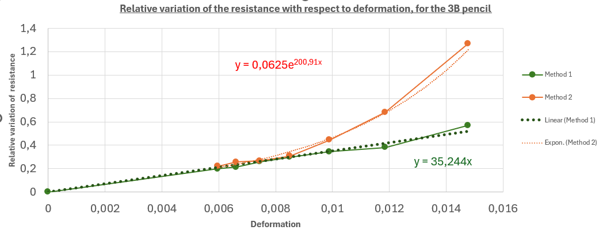 
  <em>Figure IV.3 : Courbe charactéristique du capteur avec le crayon 3B en tension </em>

**Crayon B** 

 
  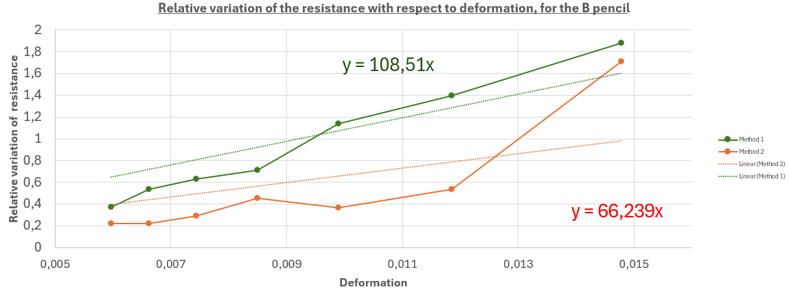 
  <em>Figure IV.3 : Courbe charactéristique du capteur avec le crayon B en tension </em>

# Partie V : Conclusion

# Contacts

Voici nos contacts si vous souhaitez des informations complémentaires

Bacchin Lisa : bacchin@insa-toulouse.fr
Barre Ronan : barr@insa-toulouse.fr
